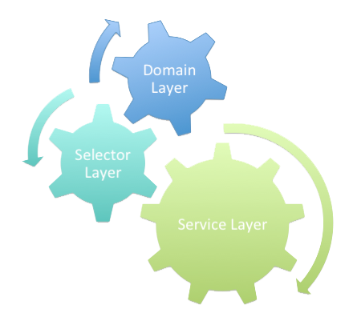

# The Complete Guide to the Apex Common Library

  

### What Is This Wiki?

This wiki hopes to simplify the concept of [Separation of Concerns](https://en.wikipedia.org/wiki/Separation_of_concerns#:~:text=In%20computer%20science%2C%20separation%20of,code%20of%20a%20computer%20program.) in Salesforce and leveraging the [Apex Common Library](https://github.com/apex-enterprise-patterns/fflib-apex-common) to implement it. While this wiki hopes to make this easier, if you finish everything here and want even more information about this topic I would suggest reading [Andy Fawcett's Salesforce Lightning Platform Enterprise Architecture Book](https://amzn.to/2R0D4BQ). Specifically pages 159-268 for Separation of Concerns and how to use Apex Commons to implement it and pages 477-520 for information on Unit Testing and Apex Mocks. It's a lot harder to consume (in my opinion) than the wiki below, but it is loaded with valuable information. It's how I learned most of what I'm presenting to you in the repo.

If you enjoy this wiki and would like to say thank you, feel free to [send a donation here](https://www.paypal.com/donate?business=RNHEF8ZWKKLDG&currency_code=USD)! But no pressure, I really just do this for fun!

---

### Table of Contents

1. [Introduction to the Separation of Concerns Design Principle](./01-Introduction-to-the-Separation-of-Concerns-Design-Principle.md)
2. [Introduction to the Apex Common Library](./02-Introduction-to-the-Apex-Common-Library.md)
3. [The Factory Pattern](./03-The-Factory-Method-Pattern.md)
4. [The fflib\_Application Class](./04-The-fflib_Application-Class.md)
5. [The Unit of Work Pattern](./05-The-Unit-of-Work-Pattern.md)
6. [The fflib\_SObjectUnitOfWork Class](./06-The-fflib_SObjectUnitOfWork-Class.md)
7. [The Service Layer](./07-The-Service-Layer.md)
8. [Implementing the Service Layer with the Apex Common Library](./08-Implementing-the-Service-Layer-with-the-Apex-Common-Library.md)
9. [The Template Method Pattern](./09-The-Template-Method-Pattern.md)
10. [The Domain Layer](./10-The-Domain-Layer.md)
11. [Implementing the Domain Layer with the Apex Common Library](./11-Implementing-The-Domain-Layer-with-the-Apex-Common-Library.md)
12. [The Builder Pattern](./12-The-Builder-Pattern.md)
13. [The Selector Layer](./13-The-Selector-Layer.md)
14. [Implementing the Selector Layer with the Apex Common Library](./14-Implementing-the-Selector-Layer-with-the-Apex-Common-Library.md)
15. [The Difference Between Unit Tests and Integration Tests](./15-The-Difference-Between-Unit-Tests-and-Integration-Tests.md)
16. [Unit Test Mocks with Separation of Concerns](./16-Unit-Test-Mocks-with-Separation-of-Concerns.md)
17. [Implementing Mock Unit Tests with the Apex Mocks Library](./17-Implementing-Mock-Unit-Tests-with-the-Apex-Mocks-Library.md)

---

### Submitting Wiki Feedback

If you believe there is any information missing from this guide or that it needs more info in certain places, please submit an [issue on this repo here](https://github.com/Coding-With-The-Force/Salesforce-Separation-Of-Concerns-And-The-Apex-Common-Library/issues) and I'll add it ASAP!
